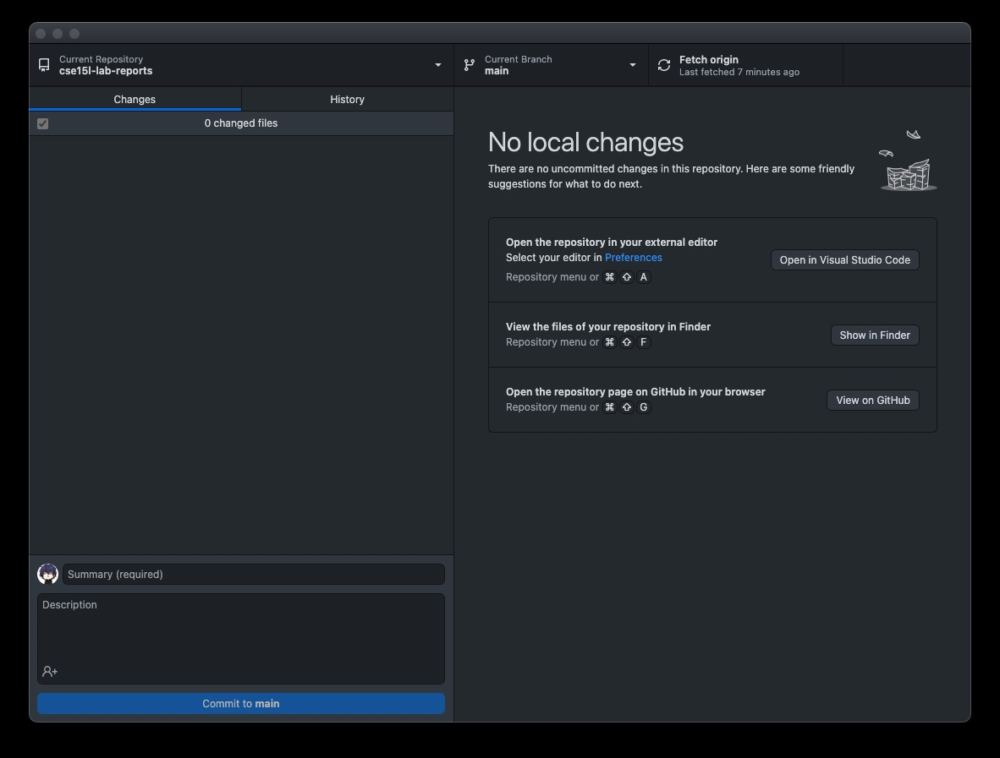

# This is my new webpage
Hi everyone, my name is Jason Tan and I am currently a junior at UCSD majoring mathematics-CS. I am very excited to learn more about how to use Git
and other tools that may help my jouney along the way. 

*Hobbies*
1. Coding
2. basketball
3. sketching

*Coding languages*
- python
- javascript
- java
- C++

# This the link to my other page

