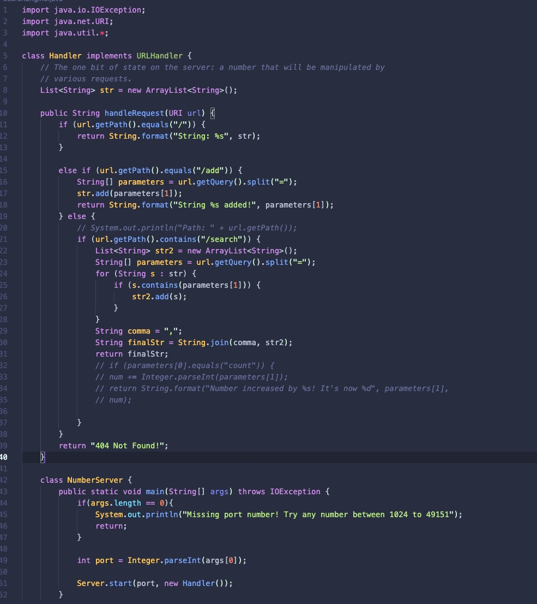
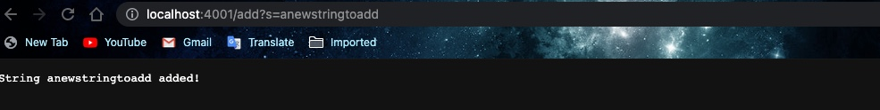
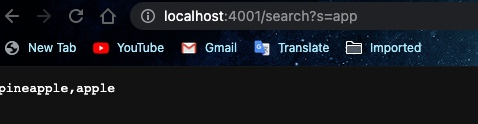
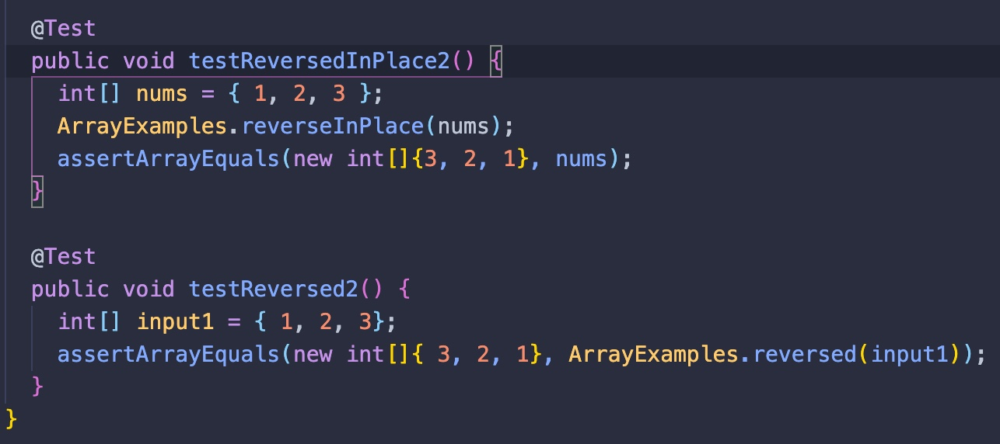
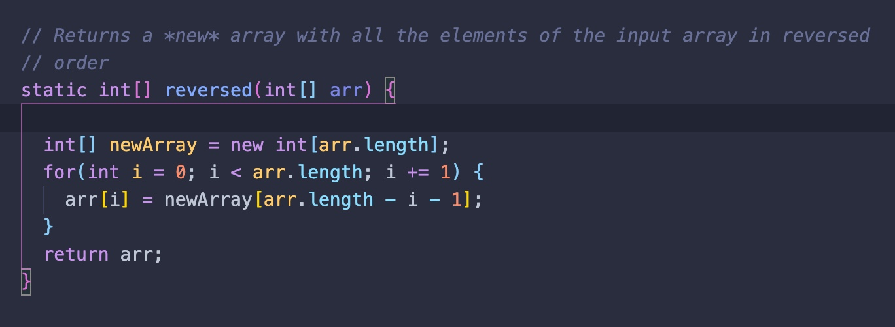
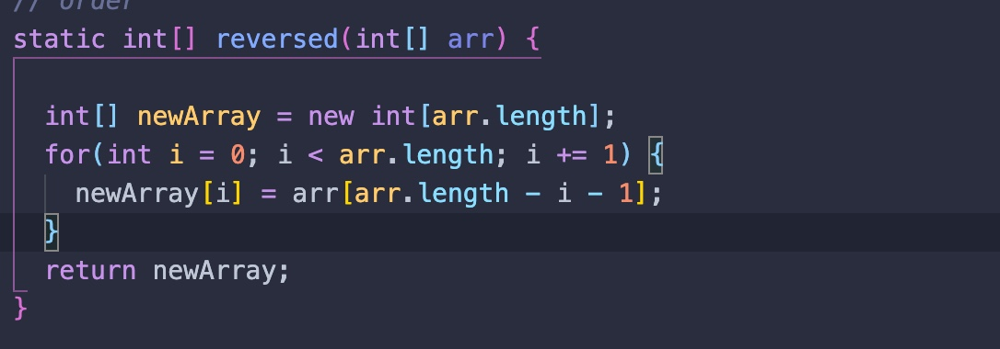
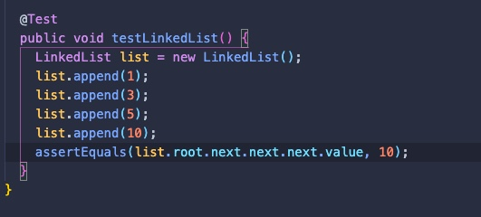

# Lab Report 3 

## Part 1 
### Serch Engine 

The screenshot above includes the searchEngine code that I implemented. In order to keep track of the data in the parameters, I implemented a list to store the strings. The class first formates the path after the "/". Following that, the else if statement handles the url by querying the path and sees if the url path contains "/add" It then splits the path by the "=" and addes it to the parameters array while printing out that the string was added. Finally, the final else statement checks to see if the path contains the "/search" path. If it does, the string is then split between the "=" and is added to a parameters array. There is a loop to check if the cucrrent list contains the string after the "/search". If this is true, the new string is added to a new String list titled str2. The final block of code then joins a "," and each value in str2, turning it into a string because the return stype of this function is a string. 

---

### Adding anewstringtoadd path

This url contains the path `/add?s=anewstringtoadd`, which is essentially telling the server to add the string "anewstringtoadd" into the current list. `/add` is the path that determines that the string must be added. If this value were to change, it would simply change the value being added into the list. 

---

### Adding Pineapple Path

This url contains the path `/add?s=pineapple`, which is telling the server to add the string "pineaple" into the list. `/add` is the path that determines that the string must be added. If this value were to change, it would simply change the value

---

### Adding Apple Path

This url contains the path `/add?s=apple`, which is telling the server to add the string "pineaple" into the list. `/add` is the path that determines that the string must be added. If this value were to change, it would simply change the value

---

### Search Path

This url contains the path `/search?s=app`, which is telling the server to find elements in the list that contain the string after "=". The value "search" is telling the server to essentially search for the list. In this case, this was the string app, so searchEngine function parses the path and grabs the string "add'. It then looks for existing strings in the list that contain "add". In this case, the program returned the strings "pineapple, apple". If this were to be another path that contained a different string, it would simply look check if any of the elements contained the new input. 

---
## Part 2

### Bug #1 **ArrayExamples: reversed** 
* The reversed function in the ArrayExamples file is the first bug I am choosing for my lab report. 
* The code below is the original **failing inducing input** that I tested using an array of `[1,2,3]`. This input assignes the values to the array and checks to see if the numbers are reversed.

* Symptom of this code happend at element [0]. The program expected `:<3>` but the value was `:<0>` instead. 

`1) testReversed2(ArrayTests)
arrays first differed at element [0]; expected:<3> but was:<0>
        at org.junit.internal.ComparisonCriteria.arrayEquals(ComparisonCriteria.java:78)
        at org.junit.internal.ComparisonCriteria.arrayEquals(ComparisonCriteria.java:28)
        at org.junit.Assert.internalArrayEquals(Assert.java:534)
        at org.junit.Assert.assertArrayEquals(Assert.java:418)
        at org.junit.Assert.assertArrayEquals(Assert.java:429)
        at ArrayTests.testReversed2(ArrayTests.java:29)
        ... 32 trimmed
`
 * **The bug** in this code was that the assingment of the reversed values to the new array did not happen. It was simply assigning it back to the original. Then, the code returned the input array instead of the new array with the reversed numbers.

 * **The Connection** between the symptom and the bug was that as the assignment of the reverse values to the new array did not happen, the terminal stated that it expected the value of 3 at the [0] index, however it received the value of 0 instead. Since the reversed values did not append to the new array, it was simply returning back the input values. 

 * **Buggy Code**
 

 * **Fixed Code**
 

 ### Bug #2 **LinkedList Examples: append**
 * The `LinkedListExample.java` file is an implementation of a liked list. In that file, the `append` method is what is causing the bugs.
 * The code below is the **failing inducing inputs** that I tested by appending the values of `1, 3, 5, 10`. The failing inducing input was utilizing the `append` method by adding numbers in order to go into it's `while` loop. 

* The symptom of this code stated that the while loop was running infinitely. 

`There was 1 failure: 1) testAppend(LinkedListTests)
java.lang.OutOfMemoryError: Java heap space
        at LinkedList.append(LinkedListExample.java:43)
        at LinkedListTests.testAppend(LinkedListTests.java:18)
`
* **The bug** in this `append` method was that in that while loop, it was checking for when `n.next` does not equal to null while also assigning a new value to every iteration of the while loop. When the code is checking for when `n.next` does not equal to null, it causes the never-ending loop because only the last element of the linked list would have the value `null`. With this in mind, the code to assign a new node to `n.next` should be outside of the while loop instead. 

* **The Connection** between the symptom and the bug is that since the bug causes an infite `while loop` that does not catch the null value of the last element in the linked list, the symtom shows an `java.lang.OutOfMemoryError: java heap space` error. 
