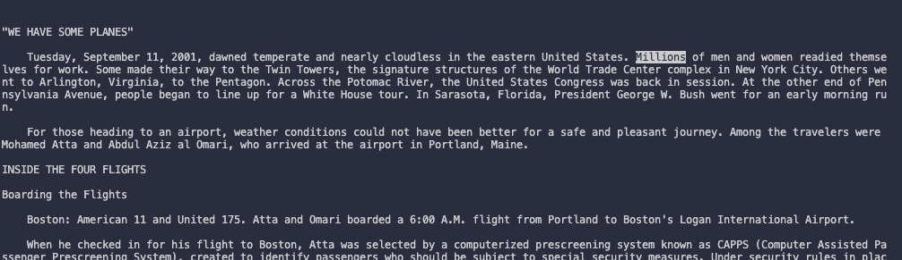

# Lab Report Week 5

## `less` Command
The `less` command is a Linux system terminal command that shows the file's contents one screen at a time. This command is mainly used as a way to deal with a large text file simply because it doesn't load the entire file, but page by page. This reults in faster load speeds. There are many `less` command options. Below are some examples and use cases for the `less` command's options.

## `less -N`
The command-line option `-N`, is used to display the line numbers at the beginning of each line. 
### Example 1:
Input
```
cd technical
cd 911report
less -N chapter1.txt
```
Output


Explanation: In this example, we went into the technical folder, then the 911report folder to use the `less -N` terminal-line option on one of the text files. This revelaed line numbers on the left of each line in the file. This is useful because we can note which line a specific sentence is without counting it.

### Example 2:
Input
```
cd technical
cd biomed
less -N pmed.0020281.txt
```

Output


Explanation: We went into the technical folder and then the biomed folder. We then used the command `less -N pmed.0020281.txt` to reveal numbers in front of each line in the text file. This is useful because it allows us to see specific line numbers without counting.

### Example 3:
Input
```
cd technical
cd biomed
less -N journal.pbio.0020001.txt
```

Output


Explanation: We went into the technical folder and then the biomed folder. We then used the command `less -N pmed.0020281.txt` to reveal numbers in front of each line in the text file. This is useful because it allows us to see specific line numbers without blindly counting. 

## `less -p<pattern>`
The command-line option `-p` if used to open a text file on the page containing the first item that matches the specified pattern.
### Example 1:
Input
```
cd technical
cd 911report
less -pMillions chapter-1.txt
```

Output


Explanation: We went into the technical folder and then the 911report folder. We then used the command `less p-Millions chapter-1.txt` to find the first occurance of the word "Millions" in that chapter-1.txt file. This is useful for searching for specific information or keywords on a text file.

### Example 2:
Input
```
cd technical
cd biomed
less -pweight 1468-6708-3-1.txt
```
Output:


Explanation: We went into the technical folder and then the biomed folder. We then used the command `less -pweight 1468-6708-3-1.txt` to find the first occurance of the word "weight" in that text file. This is useful for seraching for specific informatin or keywords on a text file. 

### Example 3:
Input:
```
cd technical
cd plos
less-pdeveloping journal.pbio.0020001.txt
```
Output:


Explanation: We went into the technical folder and then the biomed folder. We then used the command `less-pdeveloping journal.pbio.0020001.txt` to find the first occurance of the word "developing" in that text file. This is useful for seraching for specific informatin or keywords on a text file. 

## `less -m`
The command-line option `-m` if used to show the percentage of the file that the user is currently on. The percentage shows the current place of the file. As the user scrolls down the file, the percentage will change until it was at 100%, meaning it is at the end of the file. 

### Example 1
Input
```
cd technical
cd 911report
less -m chapter-1.txt
```

Output


Explanation: We went into the technical folder and then the 911report folder. We then used the `less -m chapter-1.txt` command to reveal the percentage the page is at. In the above screenshot, it shows that the file was on 13%. This is useful because if the user wants to go to a specific point on the file, the percentage can tell the user specificly where they are at. 

### Example 2
Input
```
cd technical
cd biomed 
less -m 1468-6708-3-1.txt
```

Output


Explanation: We went into the technical folder and then the 911report folder. We then used the `less -m 1468-6708-3-1.txt` command to reveal the percentage the page is at. In the above screenshot, it shows that the file was on 21%. This is useful because if the user wants to go to a specific point on the file, the percentage can tell the user specificly where they are at. 

### Example 3
Input 
```
cd technical 
cd plos
less -m journal.pbio.0020001.txt
```
Output


Explanation: We went into the technical folder and then the 911report folder. We then used the `less -m journal.pbio.0020001.txt` command to reveal the percentage the page is at. In the above screenshot, it shows that the file was on 88%. This is useful because if the user wants to go to a specific point on the file, the percentage can tell the user specificly where they are at.
