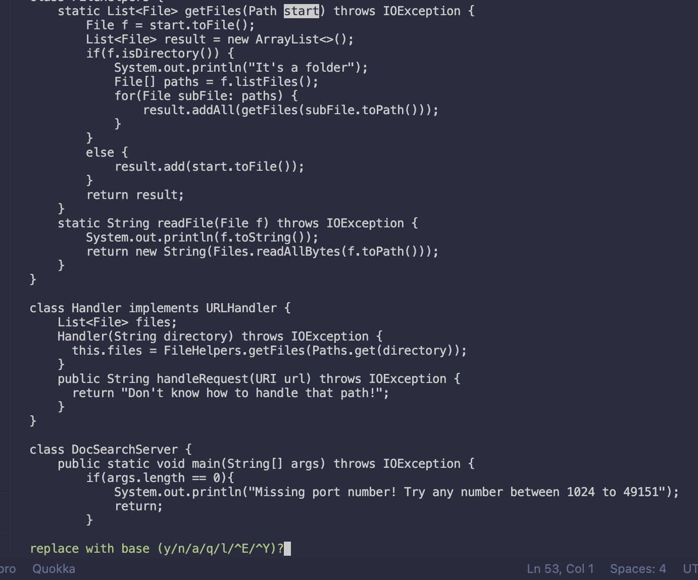
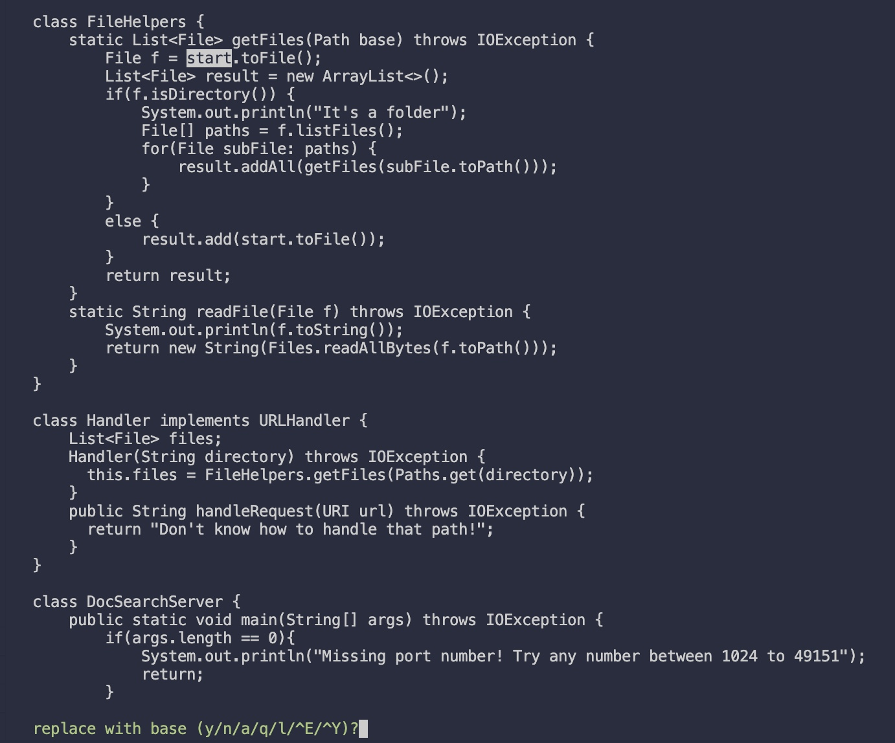
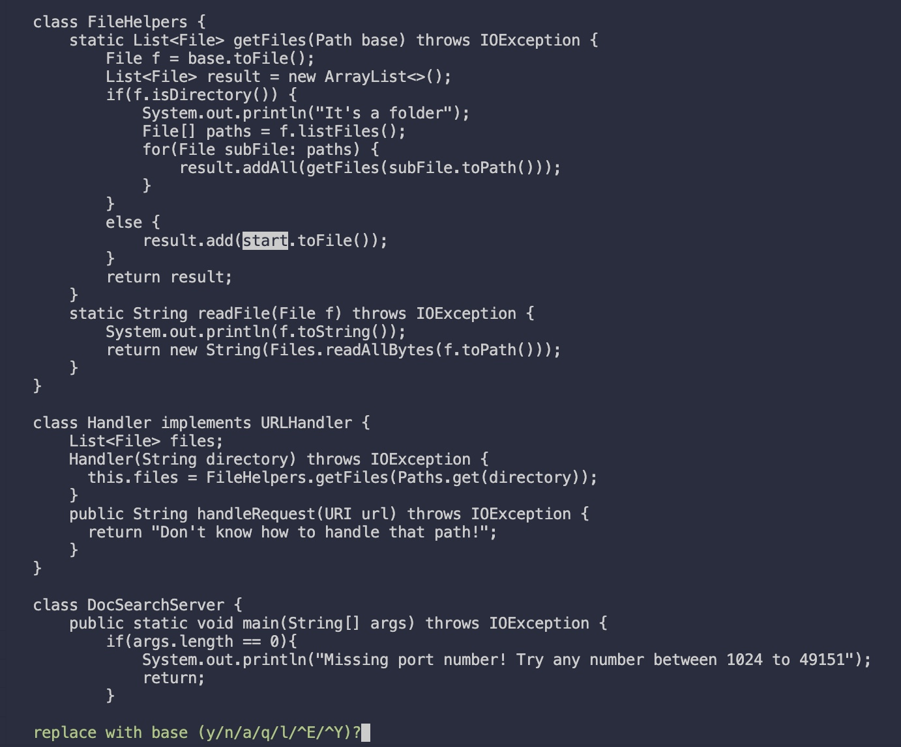
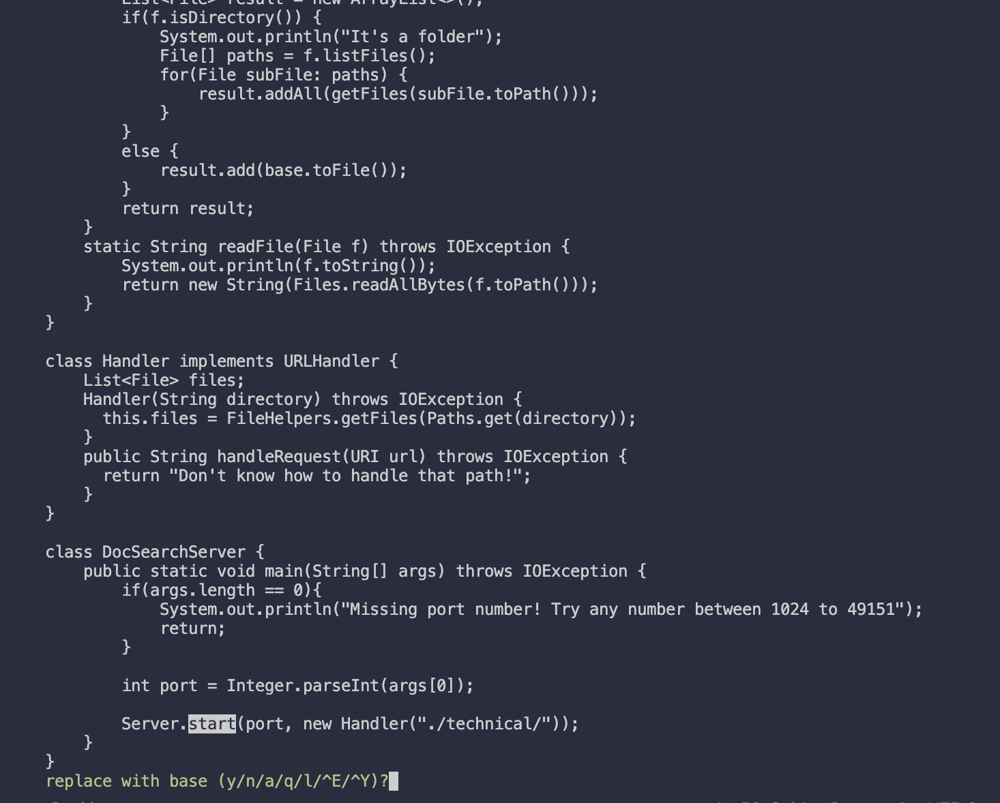
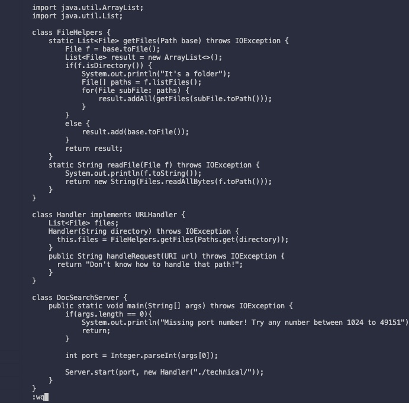

# Week 7 Lab Report

## <b>Part 1</b>

### Task: Changing the name of the `start` paremeter and its uses to `base`

### Sequence: `:%s/start/base/gc<Enter>:wq<Enter>`

&nbsp;

This one line command searches for all occurences of the text `start` with the text `base`. In each occurence, the program will ask you if you want to execute the replacement or not.

`:s` is the substitutue command, which essentially searches for a text pattern and replaces it. The `%` before the `s` means to search for all occurences in the file, not just that single line. The structure would look like `:%s/<word you want to replace>/<replacement word>`.

The `/` before the word `start` indicates that we are trying to find and replace with a certain text, while `start`is the text that the program is trying to find in the file. The second `/` indicates that the text after it will become the text we replace with. In this case, it is the word `base`. 

In this case, there is a last `/` in this command and signifies certain flags for the program. The `g` flag tells the program to execute after each occurence in the line, not just the first. The `c` flag tells the program that we want to confirm for each match what we want to do. 

Once this sequence is executed, the program will find the first occurence of the word `start`. Because of the flag `gc`, the program asks us if we want to replace the `start` with `base`.
### First Occurence
 
 This is the first occurence of the `start` in the file. After confirmation, `start` is replaced with `base`. 

### Second Occurence 

 This is the second occurence of the `start` in the file. After confirmation, `start` is replaced with `base`. 

### Third Occurence 

 This is the third occurence of the `start` in the file. After confirmation, `start` is replaced with `base`. 

### Fourth Occurence 

 This is the fourth occurence of the `start` in the file. However, since this occurence of `start` is in another function, we do not confirm the replacement, thus not changing it.  

### 7. `:wq<Enter>`
By typing out `:wq`, we are saving the changes that we have made and exiting the file. We then press enter to execute our line. 

### Total Keys: In total, this sequence contained `22` key presses!!
In 

## Part 2 

1. For the firs task, it took me a total of 55 seconds to make the edit in the VS code, scp, and finally run the bash script to start the program. 

2. For the second task, it took me a total of 47 seconds to make the edit in my remote server using Vim and running the bash script to start the program. I notice that not only running. I noticed that already starting in the remote server to run it took faster because I did not have to scp the file and then go into the remote server. 

If I had to work on a program that I was running remotely, I would definitely choose the second style where I edit already logged into an ssh session. This is far more convenient in terms of workflow because Vim allows me to easily edit files without haveing to use the mouse. I can also use certain Vim commands to aid me in editing the file.

If I was on a team and I was just introduced to a big project with code I have never seen before, I would prefer to edit in VS Code rather than Vim. With all the syntax highligting and extra viual tools, it would certainly be a better fit in this situation to use VS Code over Vim. However, if it was a a tedious task such as replacing certain words, I would prefer to use Vim because there are commands that allow me to speed up the workflow instead of having to manually change ever occurence. 

